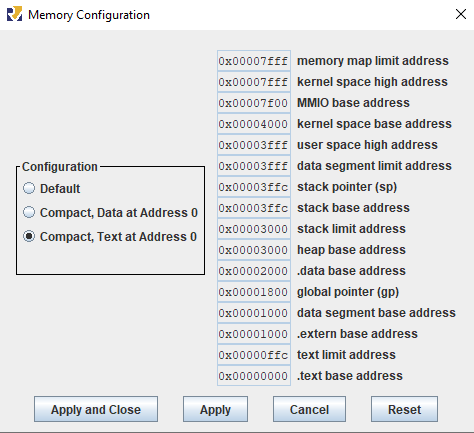
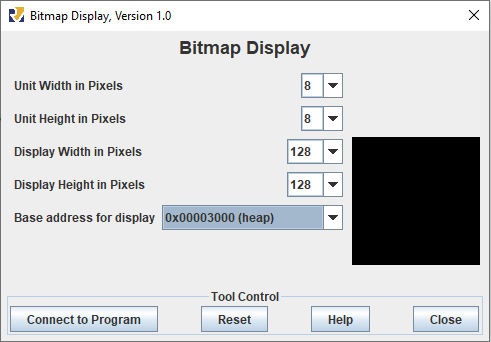

# OAC - Trabalho 3 - GameOfLife

### Aluno: **Lucas Sousa Borges - 160052408**  
### Turma C - Professor Ricardo Jacobi

### Para clonar esse repositório:

```sh
git clone https://github.com/Lucsborges/GameOfLifeAssembly.git
```


## Instruções para rodar o programa:

### Configurações:

#### Memory Configuration:
- Settings->Memory Configuration->Compact, Text at Address 0
 


#### BitMap Display:

- Endereço inicial: *0x00003000* (heap), 8x8 pixels por unidade, 128x128 pixels no total.
 


## Relatório:

### Descrição de funcionalidade e dos parâmetros de entrada e saída das funções:

- MAIN: Primeira função executada, seta nos registradores alguns valores de endereços e constantes a serem utilizados.
- LOOPPRINCIPAL: Chama as funções PLOTM e CALCULA, em loop, 50 vezes.
- PLOTM e LOOPPLOT: Escreve "0xFF00" na heap nas posições em que a matriz1 ou matriz2 possui possui valor 1.
- CALCULA (junto às próximas funções): Calcula para cada elemento da matriz, se o elemento deve conter o bit 0 ou 1 em seu conteúdo, de acordo com as regras estabelecidas.
- EXIT: chamada de sistema que encerra o programa.
  
## Código desenvolvido:
Os códigos utilizados se encontram no mesmo diretório desse documento, com o nomes "GameOfLife.asm" e "data.s".

## Indicações da plataforma utilizada:

- IDE e Interface utilizada: RARS v1.5 
- Sistema Operacional: Windows 10 Home v21H2